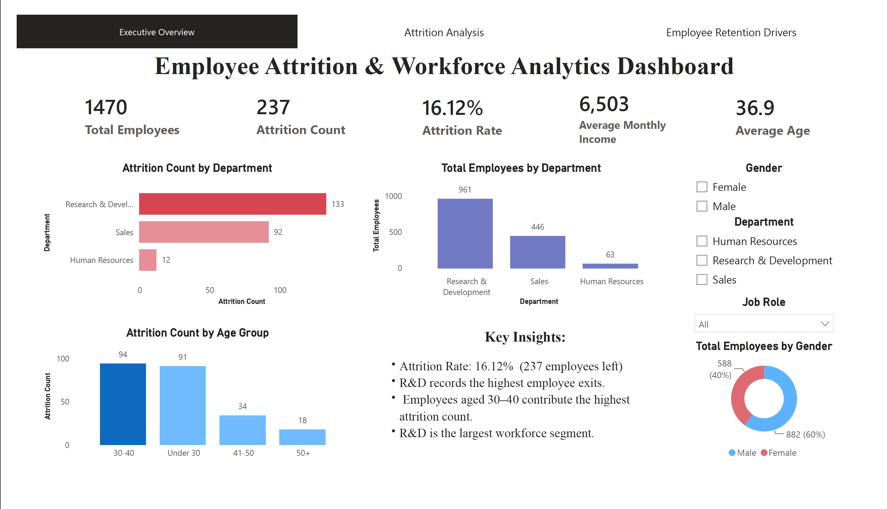
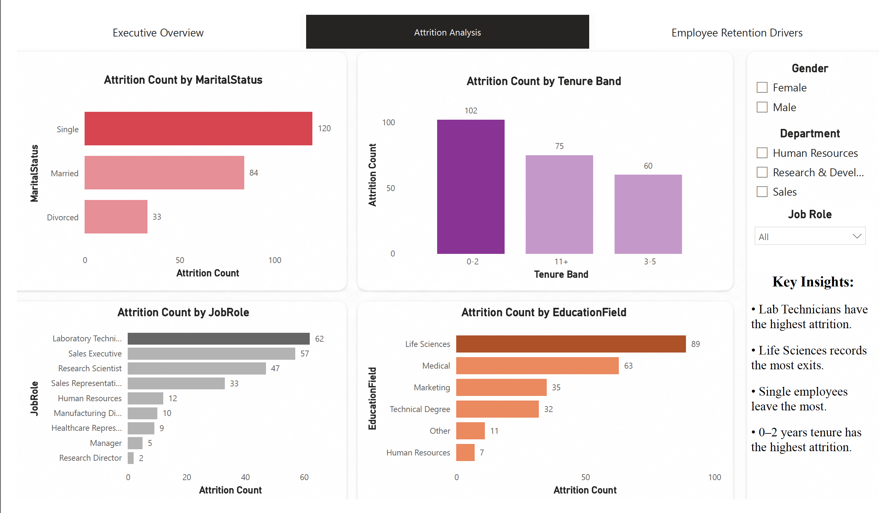
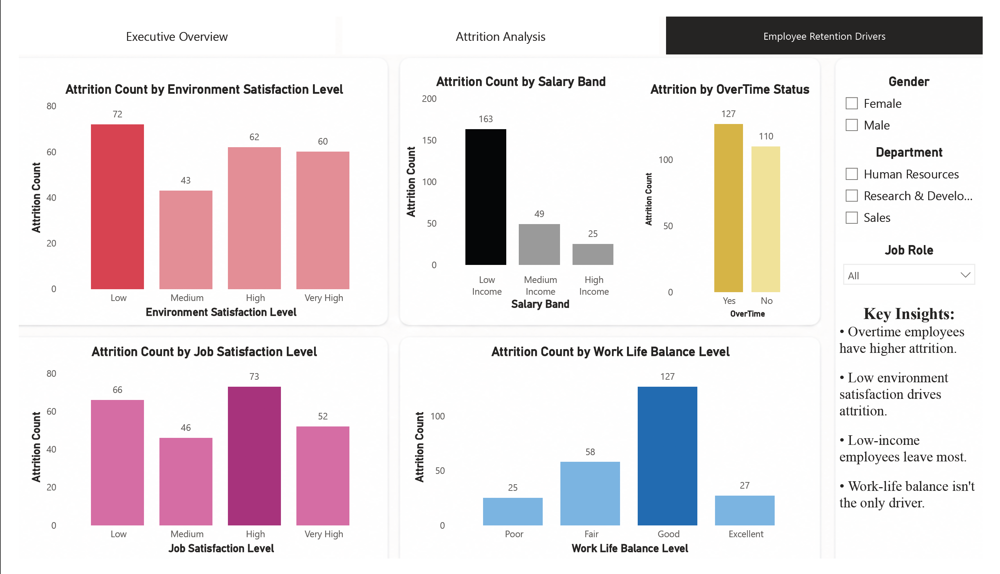
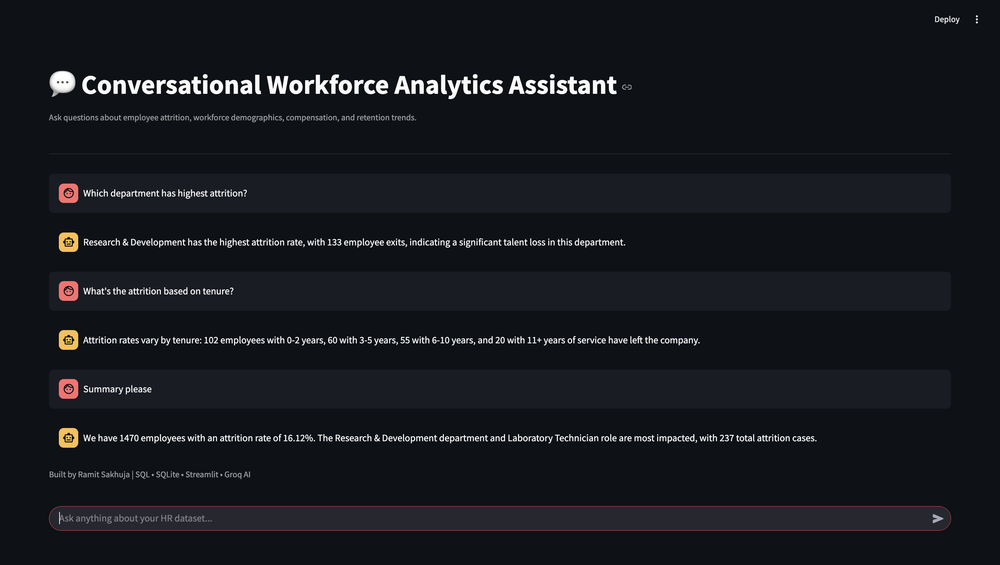

# 💬 AI-Powered Workforce Analytics Assistant

> An end-to-end HR Analytics project that combines **SQL, Power BI, Python, SQLite, Streamlit, and Groq LLM** to transform workforce data into actionable business insights through an AI-powered conversational assistant that writes and validates its own SQL.

---

## 📌 Project Overview

This project analyzes workforce data for **1,470 employees** to uncover employee attrition patterns, workforce demographics, compensation trends, and key retention drivers.

Beyond interactive dashboards, the project includes a **Conversational Workforce Analytics Assistant** that lets users ask open-ended HR questions in natural language. Rather than matching questions against a fixed list, the assistant uses an LLM to **generate a SQL query on the fly**, validates it against a set of safety rules, executes it against the database, and explains the result in plain business language.

---

# 🚀 Project Features

### 📊 Interactive Power BI Dashboard

- Executive Workforce Overview
- Employee Attrition Analysis
- Workforce Demographics
- Salary & Compensation Insights
- Employee Retention Drivers
- Dynamic Filters & KPIs
- Interactive Visualizations

---

### 🤖 AI Workforce Analytics Assistant (Text-to-SQL)

Ask open-ended questions such as:

- How many employees are there?
- What is the attrition rate?
- Which department has the highest attrition?
- Which job role has the highest attrition?
- Does overtime affect attrition?
- What's the average income for employees who left vs. stayed?
- Show me the top 5 job roles by average monthly income.
- Give me an executive summary.

The assistant isn't limited to a fixed set of pre-written questions — it can answer novel phrasings and combinations because it writes the SQL itself rather than matching keywords.

**How it works:**

- The user's question and the database schema are sent to **Groq's Llama 3.3 70B**, which generates a single SQL `SELECT` query.
- The query passes through a **validation layer** before it's allowed to run: it must be a single read-only `SELECT` statement against the known table, with no `INSERT` / `UPDATE` / `DELETE` / `DROP` / `PRAGMA` / multi-statement queries permitted.
- If the query fails (bad column, syntax error), the error is fed back to the LLM and it retries — up to two additional attempts.
- The validated query executes directly against the SQLite database.
- The result is passed to Groq LLM again to generate a concise, professional explanation. The LLM explains the numbers — it never invents them.
- The generated SQL is shown in the app alongside the answer, so the query behind every response is fully transparent and auditable.

---

# 🛠 Tech Stack

| Category | Technologies |
|-----------|--------------|
| Programming | Python |
| Database | SQLite |
| Query Language | SQL |
| Data Visualization | Power BI |
| AI | Groq Llama 3.3 70B (text-to-SQL + explanation) |
| Web App | Streamlit |
| Libraries | Pandas, Python-dotenv |

---

# 📂 Project Structure

```text
AI-Powered-Workforce-Analytics-Assistant
│
├── Data
│   └── employee_attrition.csv
│
├── SQL Analysis
│   └── HR Analytics SQL Queries.sql
│
├── PowerBI Dashboard
│   ├── HR Analytics Dashboard.pbix
│   └── HR Analytics Dashboard.pdf
│
├── Screenshots
│   ├── dashboard_page1.png
│   ├── dashboard_page2.png
│   ├── dashboard_page3.png
│   └── chatbot.png
│
├── app.py
├── chatbot.py
├── ai_assistant.py
├── database.py
├── hr_analytics.db
├── requirements.txt
├── .env.example
├── .gitignore
└── README.md
```

---

# 📊 Dashboard Preview

## Executive Overview



---

## Attrition Analysis



---

## Retention Drivers



---

# 🤖 AI Assistant



The conversational assistant converts natural language questions into a **generated SQL query**, runs it against the workforce database, and explains the results using Groq LLM. The SQL behind each answer is shown in the app for transparency.

---

# 🗄 SQL Analysis

The project includes **22 business-focused SQL queries** written and analyzed directly against the database, including:

- Total Employees
- Attrition Count
- Attrition Rate
- Average Employee Age
- Average Monthly Income
- Department-wise Employee Distribution
- Department-wise Attrition
- Salary Analysis
- Gender Analysis
- Marital Status Analysis
- Education Field Analysis
- Job Role Analysis
- Overtime Analysis
- Job Satisfaction Analysis
- Environment Satisfaction
- Work-Life Balance
- Tenure Analysis
- Salary Band Analysis
- Highest Paying Job Roles
- Department-wise Attrition Rate
- Window Functions (Ranking)

These queries formed the exploratory backbone of the project; the conversational assistant now generates equivalent (and novel) queries dynamically at runtime.

---

# 🔄 AI Workflow

```text
User Question
      │
      ▼
Streamlit Interface
      │
      ▼
Python Chatbot
      │
      ▼
Groq LLM — generates a SQL query from the question + schema
      │
      ▼
Validation layer — single SELECT only, no destructive statements,
correct table, no multi-statement queries
      │
      ├── fails validation / execution ──► error fed back to LLM,
      │                                    retries (up to 2x)
      ▼
SQLite Database — validated query executes
      │
      ▼
Query Result
      │
      ▼
Groq LLM — turns the result into a business-friendly explanation
      │
      ▼
Answer + generated SQL shown to user
```

---

# 📈 Key Business Insights

- Workforce consists of **1,470 employees**
- Overall attrition rate is **16.12%**
- Research & Development has the highest employee attrition
- Laboratory Technicians experience the highest employee exits
- Employees with **0–2 years** of tenure are more likely to leave
- Lower salary bands show higher employee attrition
- Overtime is associated with increased employee exits

---

# ⚙ Installation

Clone the repository

```bash
git clone https://github.com/ramitsakhuja/AI-Powered-Workforce-Analytics-Assistant.git
```

Move into the project

```bash
cd AI-Powered-Workforce-Analytics-Assistant
```

Install dependencies

```bash
pip install -r requirements.txt
```

Create a `.env` file

```text
GROQ_API_KEY=your_api_key_here
```

Create the SQLite database

```bash
python database.py
```

Run the application

```bash
streamlit run app.py
```

---

# 💡 Skills Demonstrated

- SQL
- SQLite
- Python
- Power BI
- Data Analysis
- Business Intelligence
- Streamlit
- Large Language Models (LLMs)
- Text-to-SQL generation
- LLM output validation & guardrails (safe query execution)
- Prompt Engineering
- API Integration
- Dashboard Design
- Data Storytelling

---

# 👨‍💻 Author

## Ramit Sakhuja

**B.Tech – Artificial Intelligence & Machine Learning**

Aspiring Data Analyst | AI Enthusiast

**LinkedIn:** https://www.linkedin.com/in/ramit-sakhuja

**GitHub:** https://github.com/ramitsakhuja
